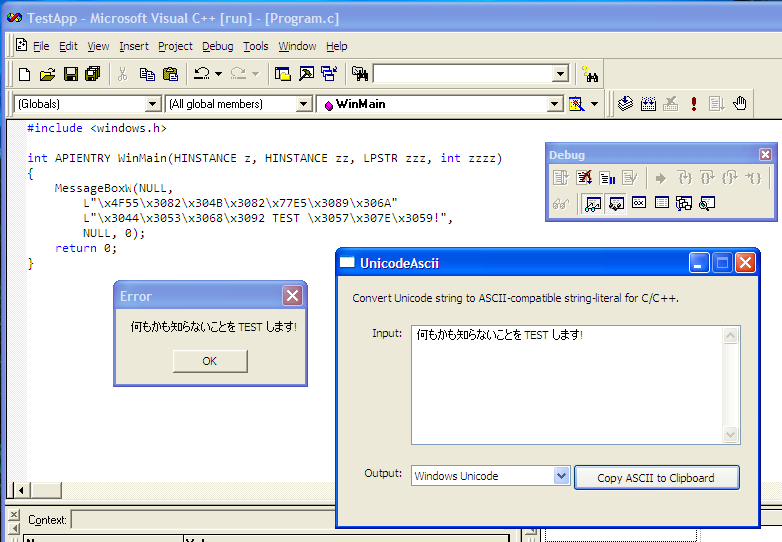

# UnicodeAscii
Convert Unicode text to ASCII-compatible string literal for C/C++.

Basically, the ASCII string generated by this tool is useful if you need to work with very outdated compiler that do not support Unicode source file.

