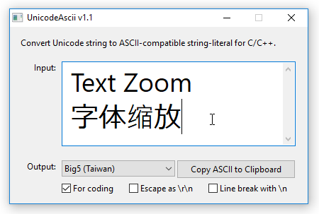

# UnicodeAscii
Convert Unicode text to ASCII-compatible string literal for C/C++.

## Main features

* Supports Windows Unicode, UTF-8 and other ANSI encodings.
* ForCoding™ generates ready-to-use ASCII for C/C++ source code.
  * Auto ``""`` (or ``L""`` for Windows Unicode) around string.
  * Auto `\n` or `\r\n` for multi-line string.
  * Escape character like forward-slash and double-quote.
  * Maximize readability while retaining functionality.  
  
* Points out unrepresentable character.
  * Some encodings do not support certain characters.  
  
* ``Alt`` mnemonics, text-zooming, visual style, system DPI scaling.  
  
  * Just zoom it like how you would zoom your web browser.
    * ``CTRL`` and ``+`` or mouse-wheel-up to zoom in.
    * ``CTRL`` and ``-`` or mouse-wheel down to zoom out.
    * ``CTRL`` and ``0`` to reset zoom.
* Pure Win32 application.
  * Can run in any OS that implements Win32 *theoretically*.
  * Zero dependency on Visual C++ runtime.
  * As such, its functionality is partly dependent on the OS it runs on. Example:
    * UTF-16 requires Windows 2000 or later.
    * UTF-8 requires Windows NT 4.0 or later.

## Feature examples

* For coding or demo
  * Original text
    * Àpple  
    Ñ2O
  * Windows Unicode
    * ``\x00C0pple``  
    ``\x00D12O``
  * Windows Unicode for coding
    * ``L"\x00C0pple\n"``  
    ``L"\x00D1" L"2O"``
  * Windows Unicode for coding + Escape as \r\n
    * ``L"\x00C0pple\r\n"``  
    ``L"\x00D1" L"2O"``

* 多行简繁中漢字
  * Original text
    * 礼仪禮儀礼儀  
战争戰爭戦争
  * Windows Unicode for coding
    *  ``L"\x793C\x4EEA\x79AE\x5100\x793C\x5100\n"``  
``L"\x6218\x4E89\x6230\x722D\x6226\x4E89"``
  * UTF-8 for coding
    * ``"\xE7\xA4\xBC\xE4\xBB\xAA\xE7\xA6\xAE\xE5\x84\x80\xE7\xA4\xBC\xE5\x84\x80\n"``  
``"\xE6\x88\x98\xE4\xBA\x89\xE6\x88\xB0\xE7\x88\xAD\xE6\x88\xA6\xE4\xBA\x89"``

* Beyond the [UTF-16 BMP][utf16bmp] characters
  * Original text
    * 𪚥 字怎么念
  * Windows Unicode for coding
    * ``L"\xD869\xDEA5 \x5B57\x600E\x4E48\x5FF5"``
  * UTF-8 for coding
    * ``"\xF0\xAA\x9A\xA5 \xE5\xAD\x97\xE6\x80\x8E\xE4\xB9\x88\xE5\xBF\xB5"``

* Rocking the ANSI legacy codepage
  * Latin-1 (CP1252)
    * ©opyright
      * ``\xA9opyright``
  * Big5 (Taiwan)
    * 中華民國
      * ``\xA4\xA4\xB5\xD8\xA5\xC1\xB0\xEA``
  * GBK (China)
    * 化繁为简
      * ``\xBB\xAF\xB7\xB1\xCE\xAA\xBC\xF2``
  * Shift-JIS (Japan)
    * 勉強しなきゃ
      * ``\x95\xD7\x8B\xAD\x82\xB5\x82\xC8\x82\xAB\x82\xE1``

## Can it run on Windows 3.1?

With Win32s v1.30 installed, yes. However, due to system limitation, you can't get much out of it. How do you 'Unicode' with a typical English Win3.1?

However, if you have a working Japanese Windows 3.1 with Japanese Win32s (v1.30) installed, you can rock the world, because Japanese Win32s will install codepage support for GB2312 (China) and Big5 (Taiwan) as well.

That said, UniAscii performs best on modern Windows (Windows 7 or later).

[utf16bmp]: https://en.wikipedia.org/wiki/Plane_(Unicode)#Basic_Multilingual_Plane
